# Ubuntu Core System development on RZG2L SBC board #
This is the quick startup guide for RZG2L SBC board (hereinafter referred to as `RZG2L-SBC`) to develop on Ubuntu LXDE (with Desktop environment support).

The following sections will describe how to build this custom Ubuntu Core image and set up the development environment for the RZG2L-SBC.

## Status
This is a Custom Ubuntu Core release of the RZG2L development product for RZG2L-SBC.

This release provides the following features:

**Audacity**
- Powerful audio editing software for recording and editing sound files.

**CSI (Camera Serial Interface)**
- High-speed interface for connecting cameras to devices, enabling the capture of high-quality video and images.

**VLC Media Player**
- Versatile media player capable of playing a wide range of audio and video formats.

**Default Web Browser**
- Lightweight browser providing essential features for internet browsing on Ubuntu LXDE.

**Wifi**
- On-board Wireless Modules enabled (supporting Wi-Fi only) for internet connectivity.

**Bluetooth**
- Generic USB Bluetooth framework supported for connecting Bluetooth devices.

**Additional Features**
- Custom Ubuntu Core build scripts for easy setup and deployment.
- RZG2L-SBC Linux BSP functionalities.
- Graphic and Codec libraries supported for various multimedia tasks.
- 40 IO expansion interfaces supported for hardware connectivity.
- On-board Audio Codec with Stereo Jack Analog Audio IO.
- MIPI DSI and MIPI CSI-2 enabled for display and camera support.
- Bootloader with U-Boot Fastboot UDP enabled for fast booting.

Known issues:

 - Only support for 48 Khz audio sampling rate family.

## Porting the Ubuntu File System
### Introduction of Ubuntu
Ubuntu-base is the minimum file system officially built by Ubuntu, which includes the Debian package manager. The size of the base package is usually only tens of megabytes, behind which there is the entire ubuntu software repository support. Ubuntu software generally has good stability. Based on Ubuntu-base, Linux software can be installed on demand, with deep customization capabilities, and it is commonly used for embedded rootfs construction.

Several common methods for building embedded file systems include busybox, yocto and buildroot. But Ubuntu offers a convenient and powerful package management system with strong community support, allowing for the installation of new software packages directly through apt-get install. This article describes how to build a complete Ubuntu system based on Ubuntu-base. Ubuntu supports many architectures such as arm, X86, powerpc, ppc, and more. This article is mainly focusing on building a complete ubuntu system based on arm as an example.

Before running the build script, please ensure that this source belongs to a regular user (not root or a privileged user), and the user executing this must have sudo/root privileges.

The `config.ini` file is used for configuring the script that builds an Ubuntu image for ARM systems. It includes essential parameters for partition sizes, the Ubuntu base file, and other configurations needed to create the rootfs and wic image. Here are the parameters that need to be configured before starting the script:
- **UBUNTU_TYPE**: Type of target Ubuntu. Available types are "**CORE**", "**LXDE**", and "**ALL**". The "ALL" option will build all Ubuntu types.
- **CLEAN_ALL**: Set to 0 to keep the current build (not recommended).
- **BOOT_SIZE_MB**: Size of the boot partition in MB. It should be larger than 100 MB.
- **ROOTFS_SPACE**: Additional space for the rootfs partition in MB.
- **core_image_qt_name**: Input rootfs (contains Qt libraries, bootloader, kernel, etc. - generated from Yocto) file name.
- **UBUNTU_BASE_FILE_NAME**: The file name of the Ubuntu base that will be downloaded.
- **UBUNTU_BASE_LINK**: The link to download the Ubuntu base file.
- **OUTPUT_ROOTFS**: The output file name for the rootfs.
- **OUTPUT_WIC**: The output file name for the wic image.
- **TIME_ZONE_AREA**: The time zone area (e.g., "Asia").
- **TIME_ZONE_CITY**: The time zone city (e.g., "Ho_Chi_Minh").
- **SSH_NO_PASS_LOGIN**: Set to 1 to enable users to log in without a password.
- **IS_WESTON_ENABLE**: Set to 0 to disable the Weston compositor.
> :memo: **Note:** Host PC with Ubuntu 22.04 is recommended for the build. Prepare environment for building package and local build environment.

Then we can execute the script as follows:
```
chmod +x rzsbc_ubuntu.sh
sudo ./rzsbc_ubuntu.sh
```

We can pass a parameter (which will override the current setting in config.ini) next to script:
```
chmod +x rzsbc_ubuntu.sh
sudo ./rzsbc_ubuntu.sh "ubuntu-core"
sudo ./rzsbc_ubuntu.sh "ubuntu-lxde"
sudo ./rzsbc_ubuntu.sh "all-ubuntu-images"
```

Here are the packages preinstalled after running the script:

| **Category**                     | **Package(s)**                                                                    |
|----------------------------------|-----------------------------------------------------------------------------------|
| **Basic Packages**               | dialog, rsyslog, systemd, avahi-daemon, avahi-utils, udhcpc, ssh, vim, net-tools, ethtool, ifupdown, iputils-ping, htop, tree, lrzsz, gpiod, wpasupplicant, kmod, iw, usbutils, memtester, alsa-utils, ufw, sudo,           |
| **Wifi & Bluetooth Controllers** | bluez, connman, network-manager, rfkill, dbus-x11, apt-utils, libssl-dev                          |
| **Audio and Video Support**      | v4l-utils, ubuntu-restricted-extras, audacity, vlc                                |
| **Desktop Environment and Browser** | xinit, lxde, lightdm, xserver-xorg, epiphany-browser, xine-ui, onboard   |


### Hierarchy
```
ubuntu/
├── config
│   └── ubuntu_lxde
│       ├── connman-gtk.desktop
│       ├── interfaces
│       ├── lightdm.conf
│       ├── NetworkManager.conf
│       ├── rsyslog
│       ├── ttyS0.conf
│       └── v4l2-init.sh
├── config.ini
├── docs
│   └── ubuntu_lxde
│       ├── Pictures
│       │   ├── audacity.png
│       │   ├── bluetooth_0.png
│       │   ├── bluetooth_1.png
│       │   ├── bluetooth_2.png
│       │   ├── bluetooth_3.png
│       │   ├── bluetooth_4.png
│       │   ├── csi_0.png
│       │   ├── csi_1.png
│       │   ├── csi_2.png
│       │   ├── eth_1.png
│       │   ├── eth_2.png
│       │   ├── eth_3.png
│       │   ├── eth_4.png
│       │   ├── eth_5.png
│       │   ├── eth.png
│       │   ├── save_audio_0.png
│       │   ├── save_audio_1.png
│       │   ├── save_audio_2.png
│       │   ├── vlc_open_0.png
│       │   ├── vlc_open_1.png
│       │   ├── vlc_open_2.png
│       │   ├── vlc.png
│       │   ├── vlc_video_1.png
│       │   ├── vlc_video.png
│       │   ├── web_1.png
│       │   ├── web_2.png
│       │   ├── web_lxterm_htop.png
│       │   ├── web.png
│       │   └── wifi_0.png
│       └── README.md
├── include
│   ├── common
│   │   ├── allow_empty_password.sh
│   │   ├── create_wic.sh
│   │   ├── install_gstreamer.sh
│   │   ├── install_weston.sh
│   │   ├── prepare_env.sh
│   │   ├── prepare_ubuntu_base.sh
│   │   └── yocto_working.sh
│   └── ubuntu_lxde
│       ├── create_swap.sh
│       ├── mount.sh
│       ├── prepare_conf.sh
│       └── prepare_rootfs_qt.sh
├── rzsbc_ubuntu.sh
└── script
    └── ubuntu_lxde
        ├── apt_audio_video.sh
        ├── apt_blueman.sh
        ├── apt_install_base.sh
        ├── apt_lxde_desktop.sh
        ├── apt_wifi_ble.sh
        ├── create_rzpi_user.sh
        ├── set_root_password.sh
        ├── set_swap_enable.sh
        └── setup-set-permissions.sh
```
### Introduction of LXDE
LXDE is a lightweight and rapid desktop environment. It is designed to be user-friendly and take up few resources while keeping resource usage low.LXDE uses less memory and CPU to present as feature-rich desktop environment as possible. Unlike other desktop environments, LXDE strives to be a modular desktop environment so that each component can be used independently. This allows porting LXDE to different distributions and platforms more easily.

LXDE contains several core components that can be used in desktop environments to manage the entire system resources. The main components are listed below:

- LXPanel: This is LXDE's panel system, similar to GNOME's GNOME Panel or KDE's Kicker. it provides rapid access to applications, system tools, folders and the clipboard.

- LXSession: This is the LXDE session manager, which is responsible for starting and terminating the LXDE desktop environment.

- LXDE-OpenBox: This is a window editor that provides window layout and navigation.LXDE uses OpenBox as its default window editor.

- PCManFM: This is a lightweight file editor that provides file and folder browsing, copying, moving, deleting, etc.

In addition to these core components, LXDE has some other auxiliary tools, such as LXAppearance (for changing themes and logos), LXTask (task manager) and so on.

## Features on Ubuntu LXDE

### Audacity

**Audacity** is a free, open-source, cross-platform audio software that is used for recording, editing, and producing audio. It allows users to capture live audio, convert tapes and records into digital recordings, and edit audio files in a variety of formats. Audacity is widely used for tasks such as podcasting, music production, and audio analysis due to its user-friendly interface and powerful editing tools. It supports multi-track editing, numerous audio effects, and plugins, making it a popular choice for both amateurs and professionals.

  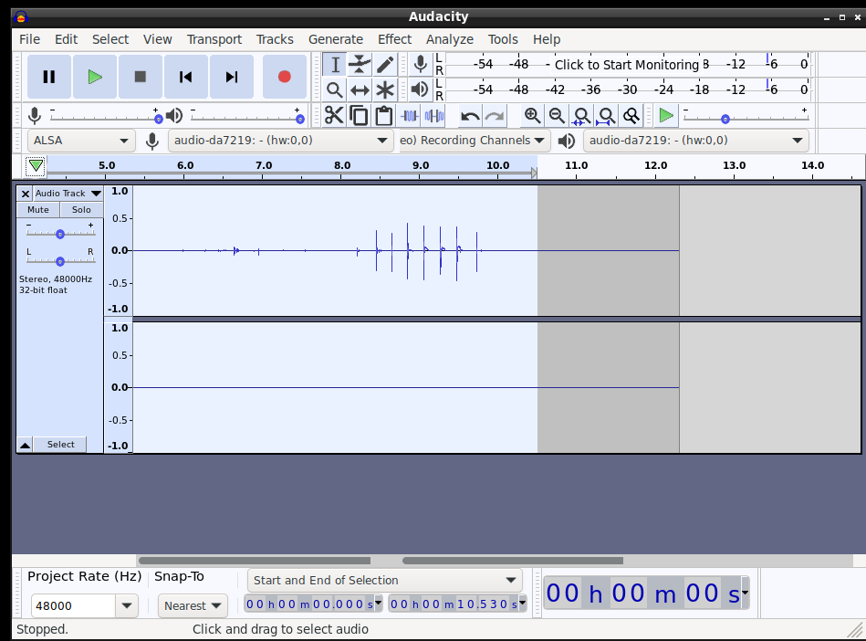

To use Audacity, we need to select **audio-da7219** for both the microphone and audio hardware options. Additionally, set the **Project Rate** to **48000** to accommodate hardware limitations. After that, click the red circle button to start recording.

To export as MP3, follow the steps in the images below.
  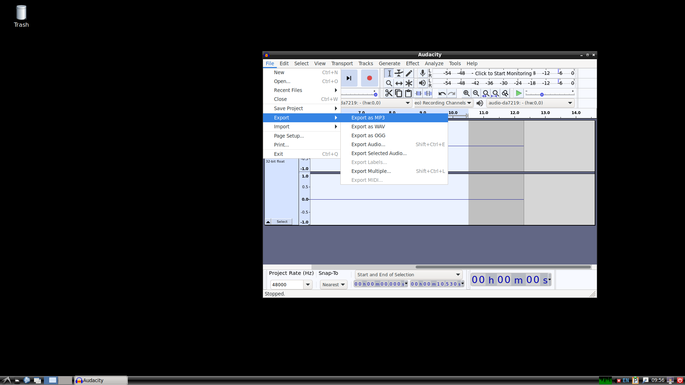

Then we can fill metadata for the audio :

  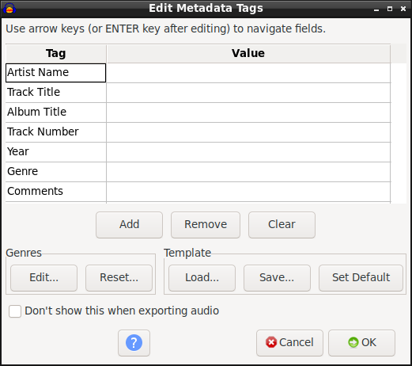

Now, we can rename the audio file that has just been recorded. For example, I will choose `song.mp3`. After that, select the directory and click **Save** to store the audio file.

  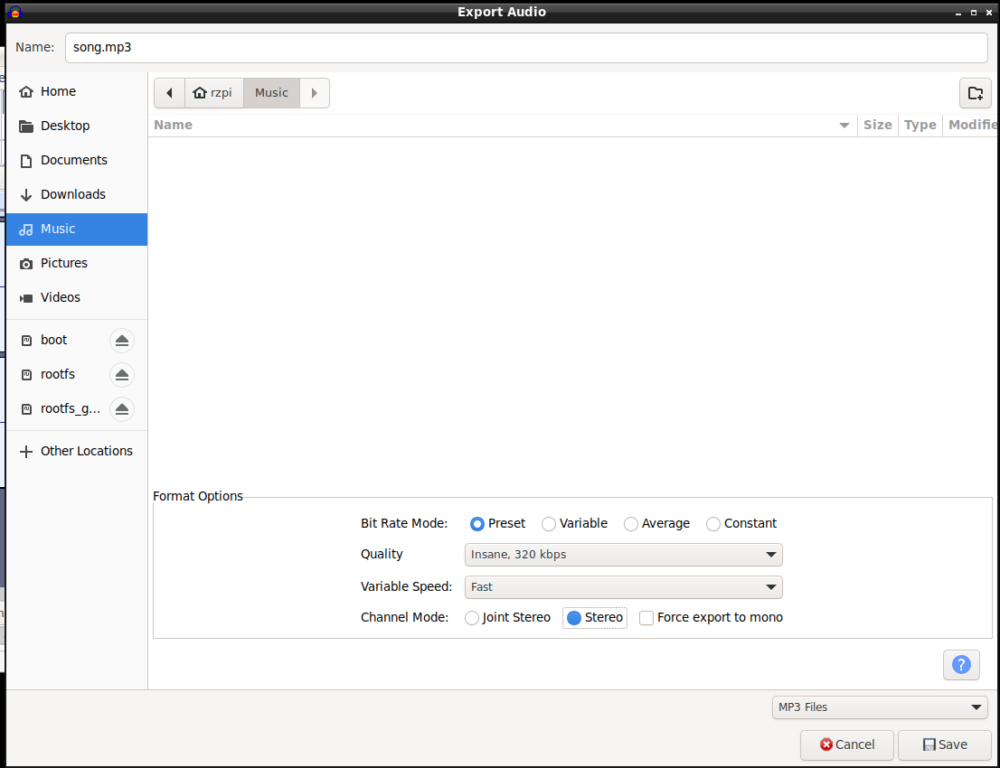

### VLC Media Player
**VLC Media Player** is a free and open-source multimedia player that supports a wide range of audio and video formats. To play music, simply open VLC and follow these steps:

1. Launch **VLC Media Player**.
  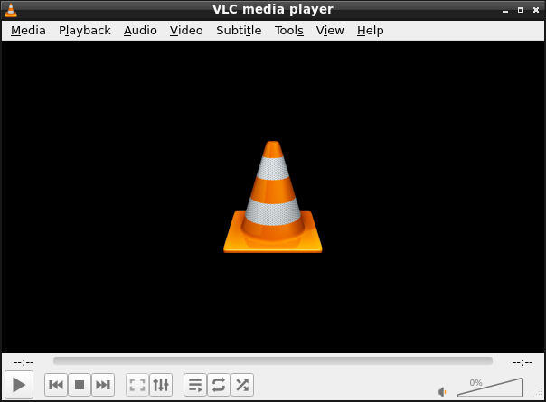
2. Click on **Media** in the top menu, then select **Open File**.
  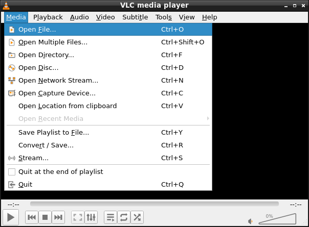
3. Browse to the location of mp3/mp4 file, select it, and click **Open** to start playing.
  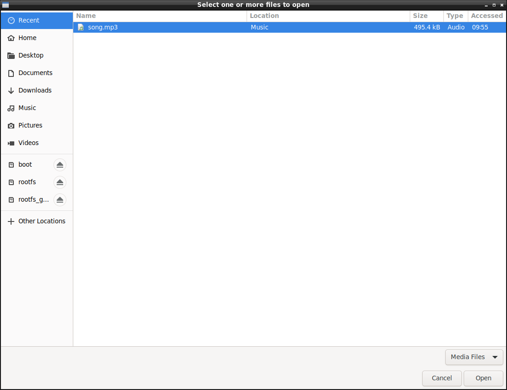
  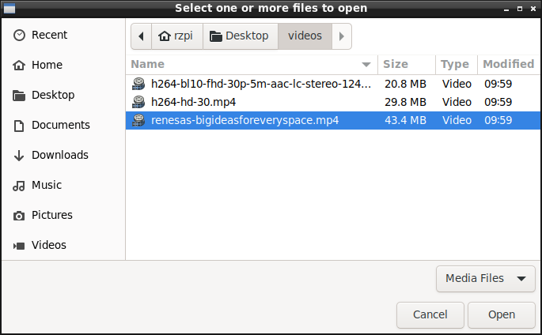
4. Now, the media can be played using **VLC**.
  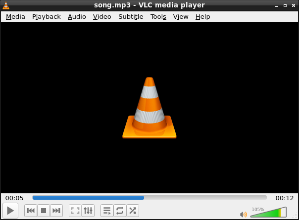
  

### Using CSI Camera with VLC
#### Introduction to CSI (Camera Serial Interface)
CSI (Camera Serial Interface) is an interface standard used to connect cameras to a device, commonly used in embedded systems like Raspberry Pi and other single-board computers. It allows for high-speed data transfer between the camera and the system, enabling the capture of high-quality video and images.

#### How to Use CSI Camera with VLC
You can use VLC Media Player to capture and view live video from a CSI camera. Here's how you can do it:

1. **Connect the Camera**: Make sure your CSI camera is connected to the CSI port on your device.

2. **Open VLC Media Player**:
   - Launch **VLC** from the application menu.

  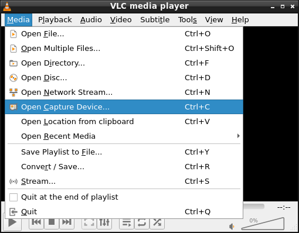

3. **Open Capture Device**:
   - In VLC, click on the **Media** menu and select **Open Capture Device...**.
   - In the **Capture Device** tab, choose **Video device name** that corresponds to your CSI camera (it might be listed as `/dev/video0` or something similar).

  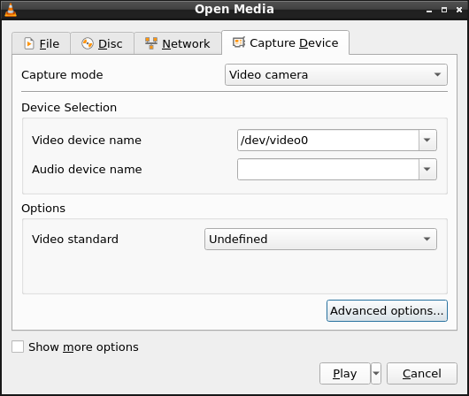

4. **Configure the Capture Settings**:
   - Choose the desired video format (e.g., MJPEG or YUY2) and resolution (e.g., 640x480, 1280x720) based on your camera capabilities.

5. **Click Play**:
   - Once you've selected the correct capture device and settings, click **Play** to start viewing the live video feed from your CSI camera.

  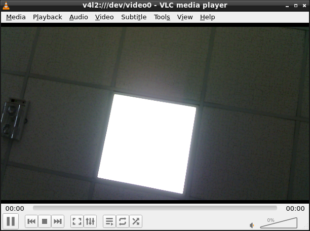

Now you should be able to see live video from your CSI camera in VLC.

### Default Web Browser

Ubuntu LXDE comes with a default web browser pre-installed. This browser provides essential features for browsing the internet and is lightweight, making it suitable for low-resource systems.

  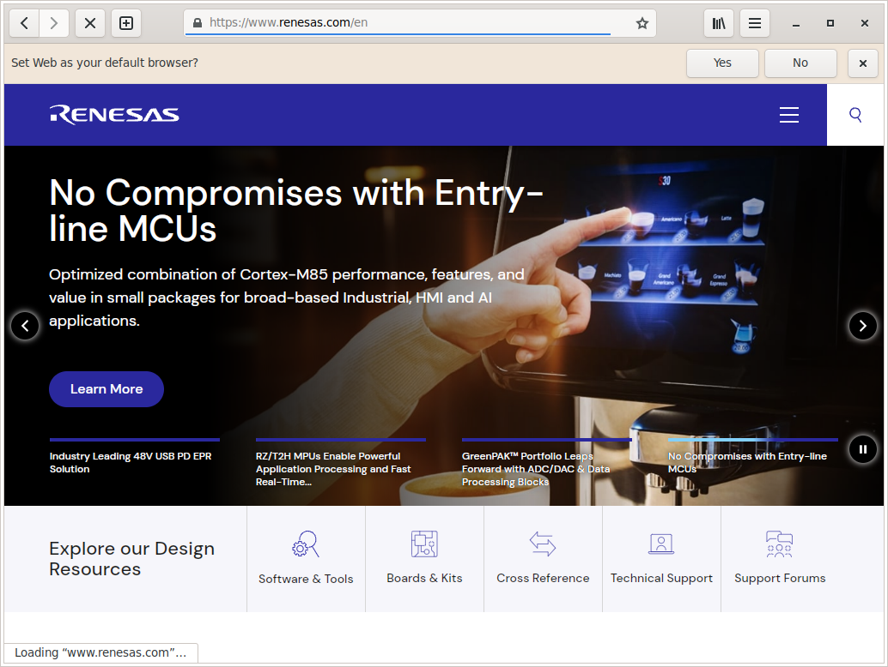

### LXTerminal

**LXTerminal** is a VTE-based terminal emulator with support for multiple tabs. It is completely desktop-independent and does not have any unnecessary dependencies. In order to reduce memory usage and increase the performance, all instances of the terminal share a single process.

#### Features:
- Lightweight and fast terminal emulator.
- Supports multiple tabs.
- Desktop-independent, reducing resource consumption.
- Optimized for performance with a single shared process for all instances.

**Example Usage**: Monitor Swap Memory with `htop` while browsing `renesas.com`

  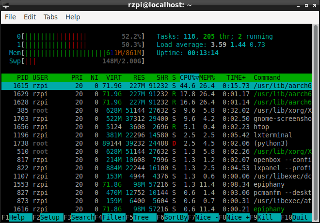

### Ethernet

Ethernet, also known as a wired network, is a widely used method to connect a device to a Local Area Network (LAN) or the internet using physical cables. On Ubuntu LXDE, connecting to an Ethernet network can be easily done through the **Network Manager**, a powerful and user-friendly network management tool.

Follow these simple steps to connect to an Ethernet network using the Network Manager UI:

1. **Open the Network Manager**:
   - At the bottom-right corner of the screen, click on the **network icon**, choose `Edit connection...`.

  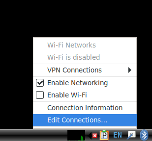

2. **Choose Your Ethernet Network**:
   - In the Network Manager menu, you should see **Wired Networks** listed. Simply click on your Ethernet connection, or manually configure it as described below (if not automatically connected).

  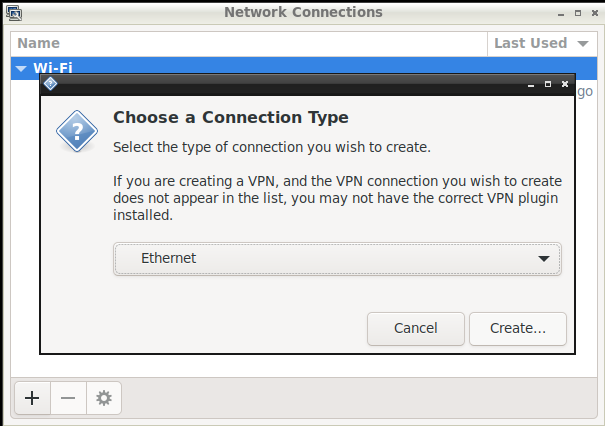

3. **Configure the Connection**:
   - If the connection is not automatically established, you can configure network settings such as IP addresses, DNS servers, etc.

  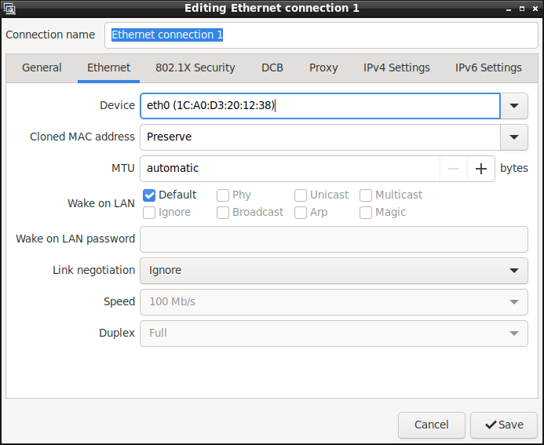
  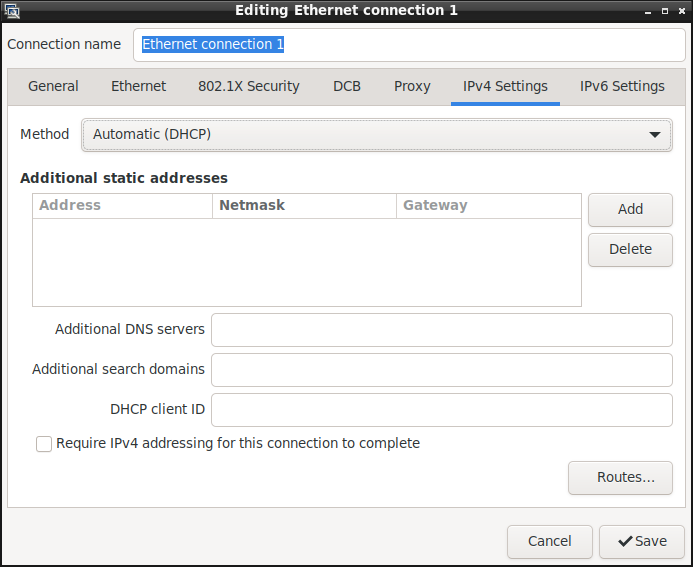

4. **Connect**:
   - Once the connection settings are confirmed, your Ethernet connection should be ready to use. You will see the network icon change to indicate a successful connection.

### Wifi
Ubuntu LXDE provides an easy way to connect to WiFi networks. Follow these simple steps to get connected:
1. **Click on the Network Icon**: In the lower-right corner of the screen, you will find the network icon. Click on this icon.
2. **Choose Your WiFi Network**: A list of available WiFi networks will appear. Find and click on your desired WiFi network from the list.

  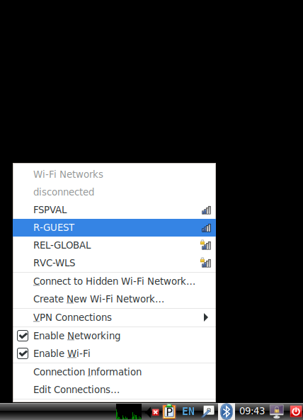

3. **Enter the Password**: After selecting the network, a prompt will appear asking for the WiFi password. Type in the password and click **Connect**.
4. **Connected**: Once the password is verified, your system will be cnnected to the WiFi network.

### Bluetooth

Ubuntu LXDE provides an easy way to connect to Bluetooth devices. Follow these simple steps to get connected:
1. **Click on the Bluetooth Icon**: In the lower-right corner of the screen, you will find the Bluetooth icon (usually a "B" symbol). Click on this icon, chosse `Devices..`.

  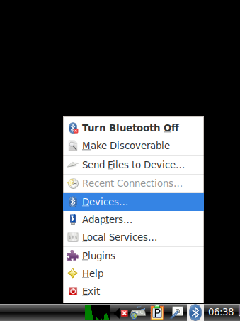
   
2. **Turn On Bluetooth**: If Bluetooth is not already enabled, you may need to turn it on by clicking the **"Turn Bluetooth On"** option.

3. **Search for Device**: Choose Adapter, Search to get a list of available devices.

  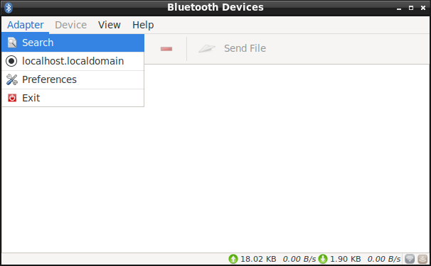

4. **Select Your Device**: A list of available Bluetooth devices will appear. Find and click on the device you wish to connect to.

  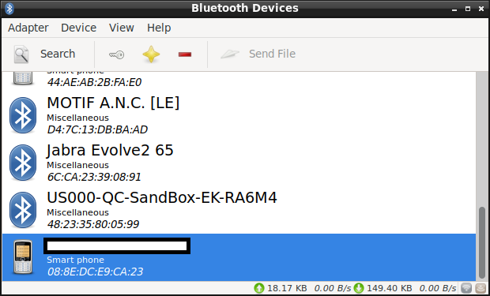
  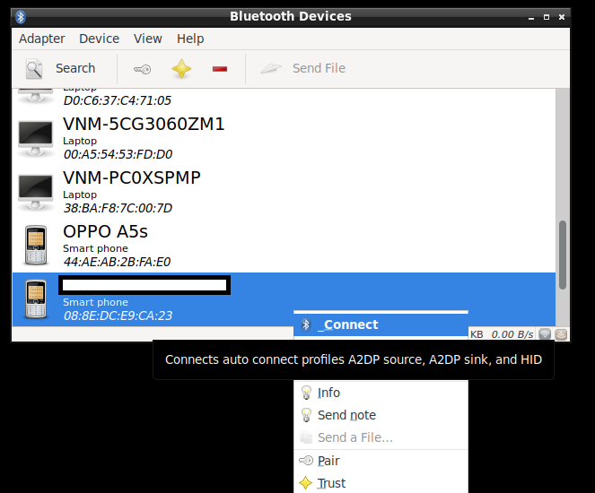

5. **Pair the Device**: If prompted, confirm the pairing request and enter the required pairing code or PIN if necessary. After confirming, the devices will be paired.

  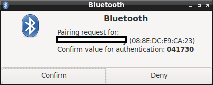

4. **Connected**: Once the pairing process is completed, your device will be connected to the Bluetooth device.
